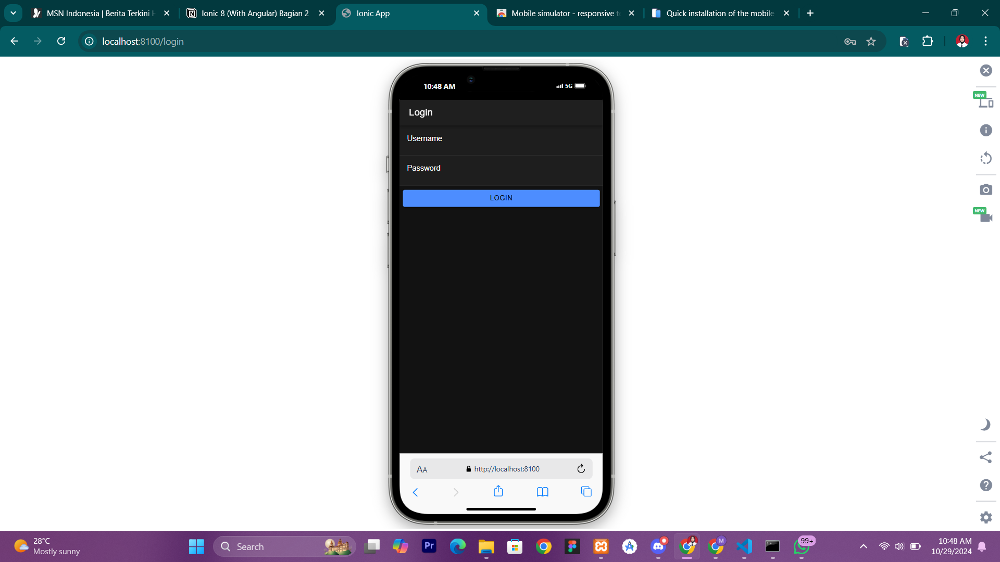
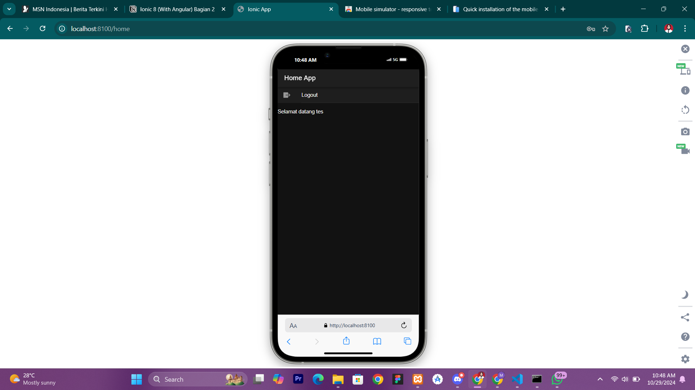

## PENJELASAN CARA LOGIN

  ## ScreenShot Hasil
  
  

Cara kerja login pada aplikasi yang sudah dipelajari ini melibatkan beberapa tahapan mulai dari konfigurasi database, koneksi API, hingga implementasi halaman login pada aplikasi Ionic. Berikut adalah tahapan cara kerjanya:
1. Membuat Database dan Tabel User:
Dibuat database coba-ionic dan tabel user dengan kolom username dan password.
Data user diisi secara manual dengan hash password menggunakan fungsi MD5 untuk keamanan.
2. Menyediakan API Backend (PHP):
Dibuat dua file PHP, yaitu koneksi.php untuk menyambungkan dengan database, dan login.php untuk memproses login.
login.php membaca data username dan password dari input JSON, lalu mencocokkannya dengan data di database.
Jika cocok, PHP akan mengembalikan status login "berhasil" beserta token sederhana berupa timestamp. Jika tidak, akan mengembalikan status "gagal".
3. Membuat Aplikasi Ionic untuk Frontend Login:
Aplikasi Ionic dibuat menggunakan framework Angular, dengan modul dan halaman yang dibutuhkan.
Modul @capacitor/preferences diinstal untuk menyimpan data token dan username secara lokal.
4. Menambahkan Service untuk Autentikasi (authentication.service.ts):
Service ini berfungsi untuk mengirim permintaan POST ke login.php di server API.
Data token dan username disimpan di perangkat pengguna menggunakan Preferences.
Fungsi postMethod() mengirim data login ke server API, sementara fungsi saveData() dan clearData() menyimpan dan menghapus data autentikasi.
5. Menambahkan Guard untuk Proteksi Halaman (auth.guard.ts dan auto-login.guard.ts):
authGuard melindungi halaman home agar hanya pengguna yang sudah login yang dapat mengaksesnya.
autoLoginGuard mencegah pengguna yang sudah login kembali ke halaman login dengan memaksa redirect ke halaman home.
6. Mengonfigurasi Routing pada app-routing.module.ts:
Routing diatur sehingga halaman home dilindungi oleh authGuard, sementara halaman login dilindungi oleh autoLoginGuard.
7. Implementasi Halaman Login (login.page.ts dan login.page.html):
Halaman login memiliki form untuk memasukkan username dan password.
Tombol login menjalankan fungsi login(), yang mengirimkan data ke service autentikasi untuk divalidasi.
Jika login berhasil, pengguna akan diarahkan ke halaman home, jika gagal, akan muncul notifikasi kesalahan.
8. Implementasi Halaman Home (home.page.ts dan home.page.html):
Pada halaman home, aplikasi menampilkan sambutan dengan nama pengguna yang login.
9. Terdapat tombol logout yang memanggil fungsi logout() di service autentikasi, yang menghapus data token dan mengarahkan pengguna kembali ke halaman login.
Komponen Notifikasi:
Digunakan AlertController dari Ionic untuk menampilkan pesan kesalahan atau status login kepada pengguna.
